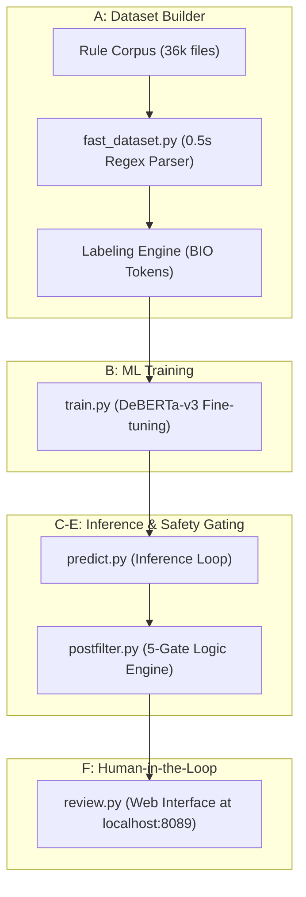

# ScanCode ML Required Phrase Marking (GSoC 2026 PoC)

This repository contains the standalone **Proof-of-Concept (PoC)** for the GSoC 2026 proposal: **ML-Based Required Phrase Marking**. 

> [!NOTE]
> **View the full GSoC Proposal here: [GSoC 2026 Proposal](https://github.com/dikshaa2909/GSoC-2026-ScanCode-Proposal)**

## 🚀 The Core Problem
ScanCode Toolkit uses **Required Phrases** (`{{marker}}`) to prevent false-positive license detections (e.g., AGPL matches on a mere URL). While existing heuristics propagate these markers, thousands of long-tail rules remain unmarked. 

This project implements a **Precision-First NLP Pipeline** using Transformer-based Token Classification (DeBERTa-v3) to automatically identify and tag these markers across the 36,000+ rule corpus.

---

## 🏗️ Architecture: The 4-Phase Pipeline



---

## 🛡️ The 5-Gate Safety System
Every ML suggestion must pass through five engineering guardrails before it reaches a maintainer. The ML system is **additive** and cannot bypass existing protection flags:

| Gate | Rejection Criteria |
|---|---|
| **1. Ignorable Overlap** | Rejects spans touching URLs, paths, or emails. |
| **2. Genericity Guard** | Rejects tokens appearing in >80% of the rule corpus. |
| **3. Rule Constraints** | Honors explicit `skip_for_required_phrase_generation` YAML flags. |
| **4. Marker Conflict** | Never overwrites or overlaps manual markers. |
| **5. Min Informativeness** | Rejects spans shorter than 2 non-stopword tokens. |

---

## 📊 Evidence of Feasibility (Prototype Metrics)
I have already validated the pipeline on the full **36,482-rule dataset** using a Logistic Regression baseline.

| Metric | Prototype Baseline | GSoC Production Target (Transformer) |
|---|---|---|
| **Span Precision (High Bucket)** | 0.34 | **≥ 0.90** |
| **Alignment Accuracy** | N/A | **≥ 99.9%** (Offset Mapping) |
| **Gate Rejection Rate** | 98% (550/647 rejected) | Maintained/Improved |

---

## 🛠️ Run the Demo (Try it Locally)

This PoC includes pre-computed results in `demo_results/` so you can view the output immediately.

### 1. Requirements
Ensure you have the dependencies installed:
```bash
pip install -r requirements.txt
```

### 2. View the Review UI
Start the standalone review server to see the current ML suggestions and their safety gate status:
```bash
export PYTHONPATH=$PYTHONPATH:$(pwd)
python3 ml_required_phrases/run_pipeline.py review --suggestions demo_results/suggestions.json
```
**Access the UI at:** `http://localhost:8089`

### 3. Generate New Results
To run the full pipeline on the `demo_rules/` subset:
```bash
# Phase A: Build Dataset
python3 ml_required_phrases/run_pipeline.py build-dataset --rules-dir demo_rules/ --output results/dataset.json

# Phase B: Train Model (Baseline)
python3 ml_required_phrases/run_pipeline.py train --dataset results/dataset.json --output results/model.pkl --sklearn

# Phase C-E: Predict with Safety Filters
python3 ml_required_phrases/run_pipeline.py predict --rules-dir demo_rules/ --model results/model.pkl --output results/suggestions.json
```

---

## 🧑‍💻 Author
**Diksha Deware**  
GitHub: [@dikshaa2909](https://github.com/dikshaa2909)  
Applied for GSoC 2026 with ScanCode Toolkit.
