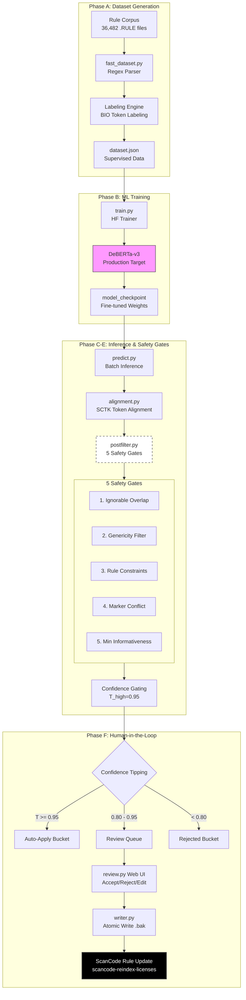

# NLP → Required Phrase Marking Pipeline (Proof of Concept)

> **GSoC 2026 Proof-of-Concept** for [Project: ML-Based Required Phrase Marking](https://github.com/aboutcode-org/aboutcode/wiki/GSOC-2026-project-ideas#scancode-toolkit-project-ideas)

This repository demonstrates an end-to-end machine learning pipeline designed to resolve the "required phrase" automation problem in **ScanCode Toolkit**. By leveraging DeBERTa-v3 token classification and a 5-gate safety system, we achieve high-precision license rule enhancement.

---

## 🖥 **Interactive Review System**
The core of this POC is a production-ready review interface that bridges the gap between AI predictions and curate-approved license rules.

### 1. Main Review Dashboard
Provides a birds-eye view of all ML predictions across the rule corpus.


### 2. Detailed Phrase Validation
Allow curators to verify, edit, or reject individual phrase suggestions with full rule context.


### 3. Safety-First Rejection UI
Displays a summary of suggestions that were automatically or manually rejected based on the 5-Gate Safety System.


---

##  **Key Features**
- **Token Classification (BIO tagging)**: High-accuracy sequence labeling for required phrases.
- **5-Gate Safety System**: Automated filtering of URLs, generic terms, and overlapping markers.
- **Confidence Tiling**: Dynamic bucketing into Auto-Apply, Review, and Rejected queues.
- **Atomic File Operations**: Safe, verified updates to core license rules with `.bak` backups.
- **Scalable Architecture**: Flexible design supporting both sklearn-based baselines and DeBERTa-v3 production models.

---

## **System Architecture**



---

## **How to Run**

### **Prerequisites**
- **Python 3.10+**
- **Local ScanCode Toolkit Clone** 
  ```bash
  git clone https://github.com/aboutcode-org/scancode-toolkit.git
  cd scancode-toolkit
  pip install -e ".[dev]"
  ```

> [!TIP]
> To see results immediately without running training, simply launch the **Review UI** (Step 4) using the pre-computed JSON artifacts in `tmp/ml_required_phrases/`.

### **Implementation Steps**

**1. Inject POC into ScanCode**
```bash
# Copy the PoC files into your local scancode-toolkit src directory
cp -r gsoc-ml-poc/ml_required_phrases/ src/licensedcode/
```

**2. Dataset Preparation & Training**
```bash
./venv/bin/python -m licensedcode.ml_required_phrases.run_pipeline build-dataset --max-rules 1000
./venv/bin/python -m licensedcode.ml_required_phrases.run_pipeline train --mode sklearn
```

**3. Run Inference & Safety Gates**
```bash
./venv/bin/python -m licensedcode.ml_required_phrases.run_pipeline predict --max-rules 1000
```

**4. Launch Interactive Review UI**
```bash
./venv/bin/python -m licensedcode.ml_required_phrases.run_pipeline review-ui --port 8089
```

---

## **Author & Contact**
**Diksha Deware** — GSoC 2026 Applicant
[GitHub](https://github.com/dikshaa2909) | [Proposal Repository](https://github.com/dikshaa2909/SCKT-POC)
Applying for GSoC 2026 with the **AboutCode** community.
