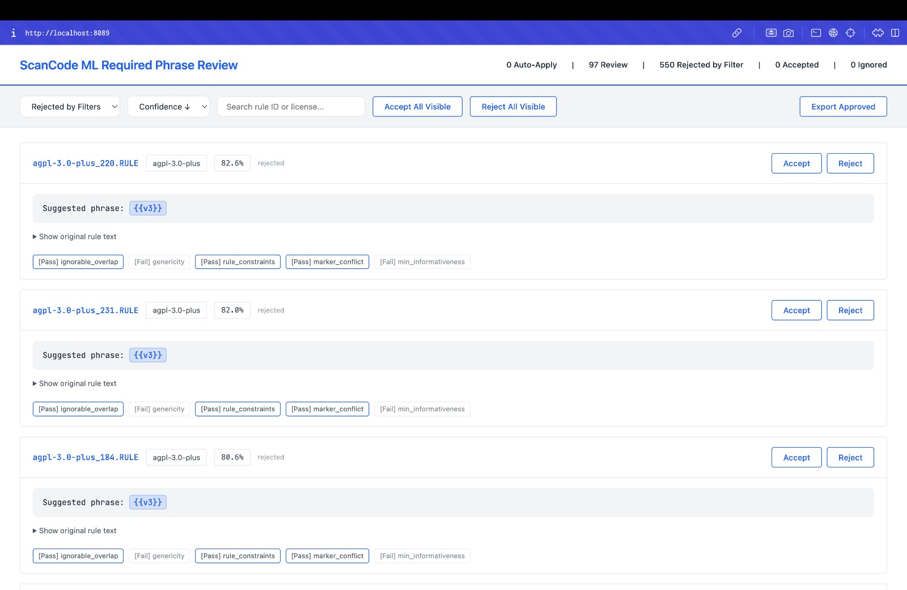

# NLP → Required Phrase Marking Pipeline (Proof of Concept)

> 🎓 GSoC 2026 proof-of-concept for [Project: ML-Based Required Phrase Marking](https://github.com/aboutcode-org/aboutcode/wiki/GSOC-2026-project-ideas#scancode-toolkit-project-ideas)

## 🖥 Human-in-the-Loop Review UI
This interactive review system allows maintainers to validate ML predictions natively. It bridges the gap between AI-driven extraction and production-ready license rules.

### 1. Main Review Dashboard
Overview of predicted phrases across the rule corpus, allowing for bulk status verification.


### 2. Detailed Phrase Validation
Granular side-by-side view for rule verification, where human curators can accept, reject, or edit individual suggestions.


### 3. Rejected Suggestions
Visualization of phrases filtered by the 5-Gate Safety System or manual rejection during the review phase.


## How to run

### Prerequisites

- Python 3.9+
- [ScanCode Toolkit](https://github.com/aboutcode-org/scancode-toolkit) (local clone required for integration)
  ```bash
  git clone https://github.com/aboutcode-org/scancode-toolkit.git
  cd scancode-toolkit
  pip install -e ".[dev]"
  ```

> **For reviewers:** The core pipeline orchestrator is in [`ml_required_phrases/run_pipeline.py`](ml_required_phrases/run_pipeline.py). To see the results without running the training or prediction jobs yourself, view the pre-computed outputs in `tmp/ml_required_phrases/` or simply launch the review UI using the included JSON data.

### Steps

**Step 1: Setup PoC in your ScanCode clone**
```bash
# Copy the PoC files into your local scancode-toolkit src directory
cp -r gsoc-ml-poc/ml_required_phrases/ src/licensedcode/
```

**Step 2: Build dataset and train the model**
```bash
# Note: We use ST's virtual environment python to run the pipeline as a module
./venv/bin/python -m licensedcode.ml_required_phrases.run_pipeline build-dataset --max-rules 1000
./venv/bin/python -m licensedcode.ml_required_phrases.run_pipeline train --mode sklearn
```

**Step 3: Run prediction and safety gates**
```bash
./venv/bin/python -m licensedcode.ml_required_phrases.run_pipeline predict --max-rules 1000
```
Predictions bounded by the 5-Gate Safety System are saved to `tmp/ml_required_phrases/suggestions.json`.

**Step 4: Open in Web Review UI**
```bash
./venv/bin/python -m licensedcode.ml_required_phrases.run_pipeline review-ui --port 8089
```

**Note:** You can also run the full end-to-end pipeline in one command:
```bash
./venv/bin/python -m licensedcode.ml_required_phrases.run_pipeline run-all --max-rules 1000
```

## Architecture

```
ScanCode Corpus             ML Inference Pipeline     Review System
┌──────────────┐     ┌─────────────────────┐     ┌──────────────────┐
│ License Rule │     │                     │     │ Suggestion UI    │
│  ├─ Text     │────▶│  DeBERTa-v3 Model   │────▶│  ├─ Rule Context │
│  ├─ Flags    │     │  (BIO labeling,     │     │  ├─ AI Proposal  │
│  │  (intro,  │     │   confidence score, │     │  ├─ Approve/Deny │
│  │   fp,     │     │   safety gating,    │     │  │  Buttons      │
│  │   ...)    │     │   ignorable URLs)   │     │  └─ Output JSON  │
└──────────────┘     └─────────────────────┘     └──────────────────┘
```

## Known limitations (POC scope)

- The fast `sklearn` estimator is primarily geared for local demo speeds; production requires `deberta` mode running on GPU instances.
- Pre-trained DeBERTa inference requires substantial compute (falling back to simple vectors for standard desktop POC testing).
- Heuristic fallback logic isn't yet fully synchronized natively inside `licensedcode.index`.
- Strictly requires running from within the ScanCode toolkit fork environment (via `setup_local.sh`) to align with existing indexing utilities.

## Author

**Diksha Deware** — GSoC 2026 applicant
[GitHub](https://github.com/dikshaa2909) | Applying for GSoC 2026 with ScanCode Toolkit
